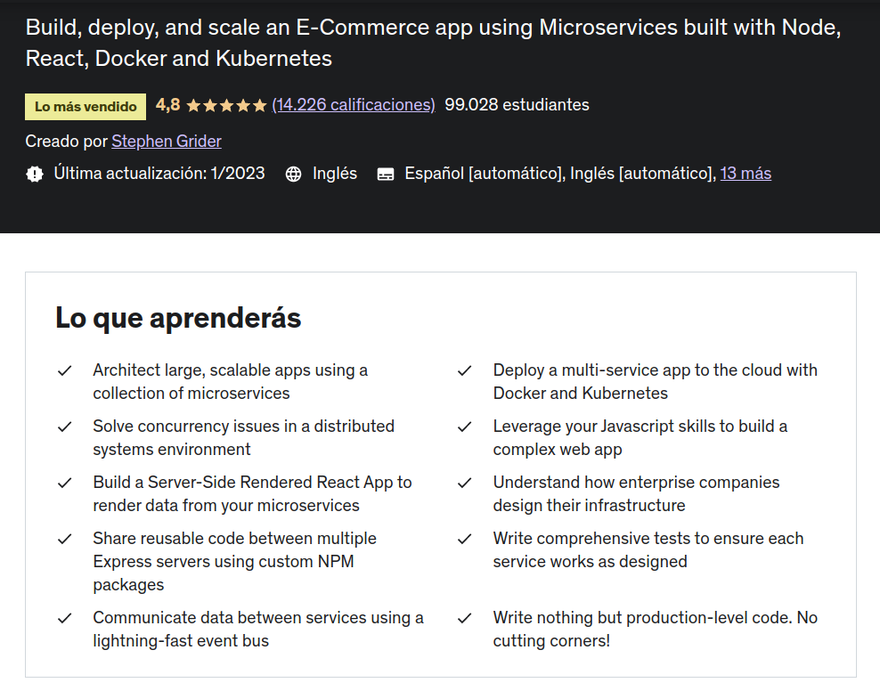
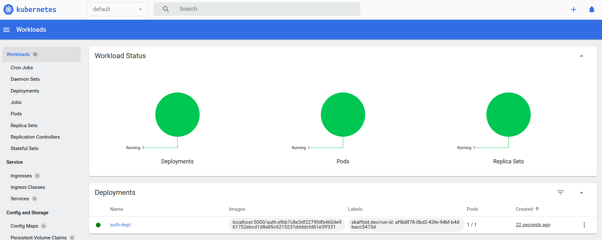

# Udemy Course MicroServices with nodejs and React js (ticket app)

## Introduction

A ticket application that shows the use of events to communicate the different micro services.

[Link to course](https://www.udemy.com/course/microservices-with-node-js-and-react/)

Note: All commands and script are prepared to run in Linux with minikube.

## Technology Stack & Tools

- Visual Studio Code
- nvm / nodejs / npm / npx
- Javascript (React & Testing)
- Express
- reactjs
- micro-services
- minikube
- Docker
- Kubernetes
- [Ingress-nginx](https://github.com/kubernetes/ingress-nginx)
- [Skaffold](https://skaffold.dev/)
- MongoDB
- Redis

## Requirements For Initial Setup

- Install [NodeJS](https://nodejs.org/)
- Docker, Docker-compose
- Kubernetes ([kubectl](https://kubernetes.io/docs/tasks/tools/install-kubectl-linux/))
- miniKube (linux)
- [Skaffold](https://skaffold.dev/)

## Setting Up

### 1. Clone/Download the Repository
  
    `$ git clone repo_url`

### 2. Install Dependencies
  
    `$ npm install` (in each folder)

### 3. Start minikube

    `$ minikube start`

### 4. Start kubectl with miniKube in Linux

    `$ ./scripts/minikube-build-images.sh`

### 5. Update local hosts file

  Add this entries:

    `192.168.49.2   posts.com`

  (192.168.49.2: 'minikube ip' command)

### 6. start All Infrastrcture

    `$ skaffold dev`

### 7. Access to App Client

    [TBC]

### 8. Access to API

    By host name (required that you add posts.com with minikube IP in your hosts file): 

    `$ http://posts.com/posts` 

    By cluster IP:

    `$ http://localhost:[IP from 'minikube ip' command]:[port from 'kubectl get services' command]/[endpoint]`

    Example: `$ http://localhost:192.168.49.2:30257/posts`

  

### 8. View minikube Dashboard

    `$ minikube dashboard` 

  

### Other Comamnds

  - Build images and put local registry

    `$ ./scripts/minikube-build-images.sh`

  - Run Infrastructuro manually

    `$ ./scripts/kubect-deploy-all.sh`

  - get specific pod port:

    `$ kubectl exec posts-depl-6c445fcf4d-qpx95 -- netstat -tupln`

  - Check someting running in port 80

    
    `$ sudo lsof -i tcp:80`

---

# Some Notes

## (+)

- The big challenge in microservices is **data**.
- Different ways to share data between services. We focused on **async communication**.
- Async communication focuses on communication changes using events sent to an **event bus**.
- Async communication encourages each service to be 100% self-sufficent. Relatively easy to handle temporary downtime or new service creation.
- Docker makes it easier to package up services.
- Kubernetes is a pain to setup, but makes it really easy to deploy + scale services.

## (-)

- Lots of duplicated code.
    * Solution: Build a central library as a NPM module to share code between differents projects.

- Really hard to picture the flow of events between services.
    * Solution: Precisely define all of our events in this shared library.

- Really hard to remember what properties an event should have.
    * Solution: Write everything in Typescript.

- Really hard to test some event flows.
    * Solution: Write tests for as much as possible/reasonable.

- Machine is getting laggy running kubernetes and everything else.
    * Solution: Run a k8s cluster in the cloud and develop on it, almost as quicly as local.

- What if someone created a comment after editing 5 other after editing a post while balancing on a tight rope.
    * Solution: Introduce a lot of code to handle concurrency issues.

---

# References

- [Kubectl Errors](./.doc/knowErrors/kubectl-errors.md)
- [Lubectl Commands](./.doc/kubectl-commands.md)
- [minikube Errors](https://stackoverflow.com/questions/60556096/unable-to-get-clusterip-service-url-from-minikube)
- [minikube Error ImagePullBackOff local repository with Minikube](https://stackoverflow.com/questions/38979231/imagepullbackoff-local-repository-with-minikube)
- [minikube Error registry](https://stackoverflow.com/questions/74493358/docker-manifest-unknown-from-local-docker-registry)
- [minikube run local images](https://stackoverflow.com/questions/42564058/how-to-use-local-docker-images-with-minikube)
- [kubernetes ingress nginx installation guide](https://kubernetes.github.io/ingress-nginx/deploy/)
- [Patterns for Microservices — Sync vs. Async](https://dzone.com/articles/patterns-for-microservices-sync-vs-async)
